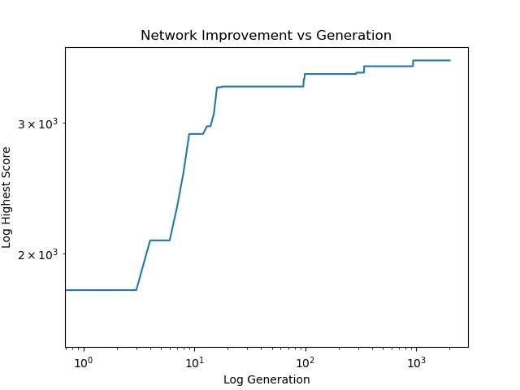

## 2048 With Neural Networks and a Micro-Genetic Algorithm ##

### Quick Description ###
I built a simplified version of 2048 in Python and trained a neural network to play it using a micro-genetic algorithm.  The trained network significantly outperformed a few baseline strategies.

Note:  I know that there are better, faster, and easier ways to solve 2048, and that training neural networks with genetic algorithms is ridiculous.  Frankly, solving 2048 with deep Q learning has been done to death.  I thought it would be fun to try something new.

## A More Detailed Look ##
### Scoring and a Bit of Math ###
Scoring follows the usual 2048 rules:  If two tiles of value `n` collide, then your score increases by `2n`.  Since the tile values grow exponentially, the scores do as well.  This means that if we have a distribution of scores, the usual arithmetic mean won't be very useful because the largest term will dominate.  Therefore, every time I mention the average or mean of something in this post I am instead referring to the geometric mean, defined for positive values as:


This gives a more meaningful notion of averages for exponentially growing scores.


### The Baseline ###
To get an idea of how well the trained network performs, we need something to compare it to.  Starting with a random algorithm, I played 10,000 games moving in each legal direction with equal probability and got an average score of 965.  I then played another 10,000 games using an algorithm that tries to push tiles to the bottom-right corner, which is closer to the "correct" 2048 strategy, and unsurprisingly performed better with an average score of 2491.  Finally, I played 10,000 games with a greedy algorithm which always chooses whichever move maximizes its score each turn.  This performed slightly better still with an average score of 2696.  The table below summarizes these results:

Highest Tile at Game Over | Random  | Corner   | Greedy
:------------------------:|:-------:|:--------:|:------
16                        | 0.3%    |          | 
32                        | 7.0%    | 0.2%     | 0.2%
64                        | 38.0%   | 7.3%     | 4.6%
128                       | 46.8%   | 40.9%    | 34.9%
256                       | 7.9%    | 42.5%    | 47.0%
512                       |         | 9.0%     | 13.1%
1024                      |         |          | 0.2%
**Average Score**         | **965** | **2491** | **2696**

Any network we train must convincingly beat these scores to be considered a success.


### The Network ###
The neural network itself is a simple feed-forward net with 16 inputs representing the base-2 logarithm of the 16 board positions.  The 3x3 example below illustrates this:
```
The Board              What the Network Sees
[ ][ ][2]
[8][ ][ ]   --->    [0, 0, 1, 3, 0, 0, 0, 2, 1]
[ ][4][2]
```
This is passed into a network with two hidden layers of size 128.  For simplicity, the network weights are all either 1, -1, or 0, and the activation for each node is the sign function.  The output layer has four nodes corresponding to the decision to move left, right, up, or down, respectively, and the largest-magnitude legal output is the move that occurs.  I fiddled with different network architectures, but they all had about the same performance.


### The Micro-Genetic Algorithm ###
A micro-genetic algorithm works similarly to a genetic algorithm in that we have a population of neural networks which compete for survival, reproduce, and mutate.  The difference with a micro-genetic algorithm is that the size of the population is restricted, the mutation rate is increased, and every few generations the population is wiped out and replaced with random networks to preserve diversity.  Additionally, this algorithm makes use of elitism, meaning the best network is rendered immortal and copied from generation to generation until a better network emerges and beats it out.  All of these changes together mean that a larger region of the parameter space can be explored in a relatively short time without compromising the current best model.

In more detail, we start with 32 random networks.  Each one plays twenty games, and then the bottom half by average score are removed.  The remaining sixteen networks play a further 30 games, and the bottom half are again culled.  The final eight networks play 250 more games to determine their final score.  This large number of games is needed since (even on a log scale) the variance of 2048 scores for a given network is extremely large.  It takes many attempts to get a reliable estimate of the mean score, and even the 300 total here are barely sufficient.

Thus completes the first generation.  For future generations, the best network from the previous generation is copied, and the top eight surviving networks reproduce to create 31 children via a fitness-proportionate selection determined by their average score.  The parents' weights are randomly passed down row-by-row to the child network.  Mutation then occurs by randomly flipping 1% of the children's weights.  The culling from 32 to sixteen to eight is then repeated as in the first generation, except that now only the networks in the top eight whose average score is within two standard deviations of the best network's score get to play the full 300 games.  This speeds up the algorithm substantially by not testing networks whose scores render them unlikely to succeed.


### The Results ###
I trained a population of networks for 2000 generations.  The following is a log-log plot of the best net's average score at each generation:



Before we discuss this image, let's also perform a more quantitative examination.  Taking the best network from the 2000th generation and playing 10,000 games with it gives the results in the table below, which I've compared to the baselines we established earlier:

Highest Tile at Game Over | Random  | Corner   | Greedy   | Network
:------------------------:|:-------:|:--------:|:---------|:-------
16                        | 0.3%    |          |          | 
32                        | 7.0%    | 0.2%     | 0.2%     | 0.3%
64                        | 38.0%   | 7.3%     | 4.6%     | 4.6%
128                       | 46.8%   | 40.9%    | 34.9%    | 22.1%
256                       | 7.9%    | 42.5%    | 47.0%    | 51.1%
512                       |         | 9.0%     | 13.1%    | 21.5%
1024                      |         |          | 0.2%     | 0.4%
**Average Score**         | **965** | **2491** | **2696** | **3191**

We have a clear improvement, though the elusive 2048 tile continues to escape us.  The trained network quickly beat out the baselines, but stagnated around generation 1000 and saw no improvement from there.  I tried a few different network architectures and strategies, but all gave approximately the same performance.  Some of my past, unsaved runs did better, but not by much.  Still, the improved performance, though not as dramatic as I'd hoped for, is enough for me to consider this a successful experiment.

Note: The average score in the table is lower than the average score in the chart because playing only 300 games during training overestimated the true average.


### Conclusion ###
This was a fun project to work on, and I'm surprised at just how quickly the micro-genetic algorithm was able to beat out the baselines.  If you have any suggestions to improve this, please let me know!
