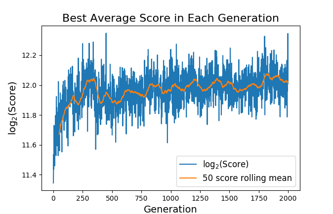

## 2048 With Neural Nets and a Micro-Genetic Algorithm ##

###\*\*This readme is out of date as the repo is under active development** ###

### Quick Description ###
I built a simplified version of 2048 in Python and trained a neural network to play it using a micro-genetic algorithm.  The trained network significantly outperformed both random movement and movement following a very simple strategy.

Note:  I know that there are better, faster, and easier ways to solve 2048, and that training neural networks with genetic algorithms is ridiculous.  I just thought it would be fun to try.

### Content ###
* [game.py](https://github.com/clambro/2048-Micro-Genetic/blob/master/src/game.py) -- The 2048 game itself.  Can be played manually (on Windows) or by a network.
* [net.py](https://github.com/clambro/2048-Micro-Genetic/blob/master/src/net.py) -- The neural network, including rules for reproduction and mutation.
* [population.py](https://github.com/clambro/2048-Micro-Genetic/blob/master/src/population.py) -- A list of networks that form a generation.  Training occurs here.
* [Best_Net_Gen_2000.npy](https://github.com/clambro/2048-Micro-Genetic/blob/master/Best_Net_Gen_2000.npy) -- The network produced by 2000 generations of evolution.
* [misc](https://github.com/clambro/2048-Micro-Genetic/tree/master/misc) -- A folder containing various statistics and images, some of which are used below.


## A More Detailed Look ##
### Scoring and a Bit of Math ###
Scoring follows the usual 2048 rules:  If two tiles of value `n` collide, then your score increases by `2n`.  Since the tile values grow exponentially, the scores do as well.  This means that if we have a distribution of scores, the usual arithmetic average won't be very meaningful because the largest term will dominate.  Therefore, every time I mention the average or mean of something in this post I am instead referring to the geometric mean, defined for positive values as:


This gives a more meaningful notion of averages for exponentially growing scores.


### The Baseline ###
To get an idea of how well the trained net performs, we need something to compare it to.  Starting with a random algorithm, I played 10,000 games, moving in each direction with equal probability, and got an average score of 1027.  I then played another 10,000 games using an algorithm that always chose the first legal move in the order `[left, up, right, down]`, which is closer to the "correct" 2048 strategy and unsurprisingly performed better:

Highest Tile at Game Over | Random Movement | Ordered Movement
:------------------------:|:---------------:|:---------------:
16 | 0.26% | 0.07%
32 | 5.22% | 1.3%
64 | 33.11% | 9.51%
128 | 50.5% | 32.4%
256 | 10.85% | 48.98%
512 | 0.06% | 7.74%
**Average Score** | **1027** | **2169**

Any network we train must convincingly beat these scores to be considered a success.


### The Network ###
The neural net itself is a simple feed-forward net with 16 inputs representing the base-2 logarithm of the 16 board positions, normalized by the highest tile present.  The 3x3 example below illustrates this:
```
The Board                What the Network Sees
[ ][ ][2]
[8][ ][ ]   --->    [0, 0, 1/3, 1, 0, 0, 0, 2/3, 1/3]
[ ][4][2]
```
This is passed into a fully-connected hidden layer of size 16 and activated by a leaky ReLU.  This is then passed into an output layer of size 4.  The four outputs correspond to the decision to move left, up, right, or down, respectively, and the largest-magnitude legal output is the move that occurs.


### The Micro-Genetic Algorithm ###
A micro-genetic algorithm works similarly to a genetic algorithm in that we have a population of neural networks which compete for survival, reproduce, and mutate.  The difference is that the size of the population is restricted to 10 networks, and that every 10 generations all but the top two are wiped away and replaced with 8 randomly generated networks.  This keeps genetic diversity high while immortalizing the best-of-the-best, meaning a larger region of the parameter space can be explored in a relatively short time without compromising what we already have.

Aside from those key differences, the rest of the algorithm is as expected.  Every generation, the 10 networks play 50 games each, and their scores are averaged.  The top two are copied directly into the next generation (elitism), but all networks get the chance to reproduce.  To do so, two networks come together as parents after a tournament selection and generate a child network by randomly passing on elements of their weight matrices.  The new matrices then undergo a small, random mutation.  This is repeated until we have eight children to join the two copied networks, which form the next generation.


### The Results ###
I trained a population of networks for 2000 generations.  The following is a graph of the best net's average score at each generation:



Before we discuss this image, let's also perform a more quantitative examination.  Taking the best network from the 2000th generation and playing 10,000 games with it gives the results in the table below, which I've compared to the baselines we established earlier:

Highest Tile at Game Over | Random Movement | Ordered Movement | Trained Network
:------------------------:|:---------------:|:----------------:|:----------:
16 | 0.26% | 0.07% | 
32 | 5.22% | 1.3% | 0.1%
64 | 33.11% | 9.51% | 2.7%
128 | 50.5% | 32.4% | 16.1%
256 | 10.85% | 48.98% | 49.2%
512 | 0.06% | 7.74% | 30.3%
1024 |  |  | 1.6%
**Average Score** | **1027** | **2169** | **3761**

We have a clear and significant improvement, though the elusive 2048 tile continues to escape us.  According to this table, the average log2-score after 10,000 games in the table is about 11.87, whereas the "best scores" in the graph near generation 2000 fluctuate wildly between 11.85 and 12.15.  This means that the "best score" as seen on the graph is not representative of the actual best score in the population because the variance is too high.  What appears to be happening is that weaker networks, through sheer luck, occasionally outperform the better ones and displace them from the elite positions that guarantee their survival to the next generation.  This would explain the sudden drops in score, for example around generation 400.  Playing more games per generation reduces the variance of the score, but this is very slow.


### Conclusion ###
This was a fun project to work on, and I'm surprised at just how quickly the micro-genetic algorithm was able to beat out the baselines.  If you have any suggestions to improve this, please let me know!
